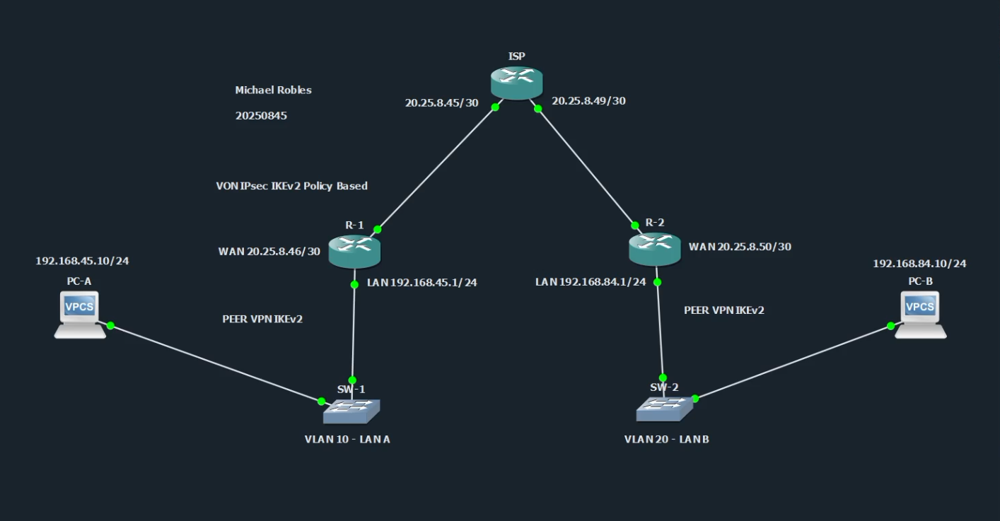
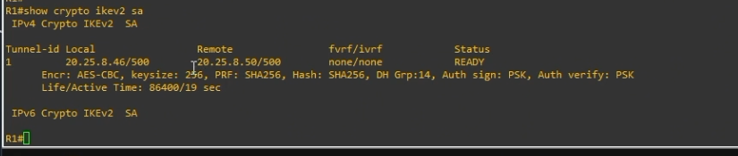
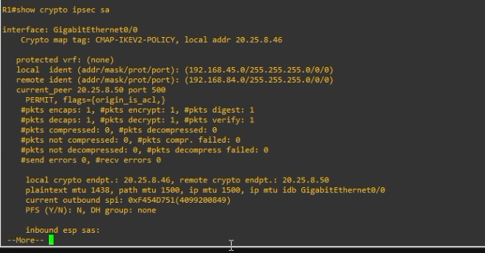
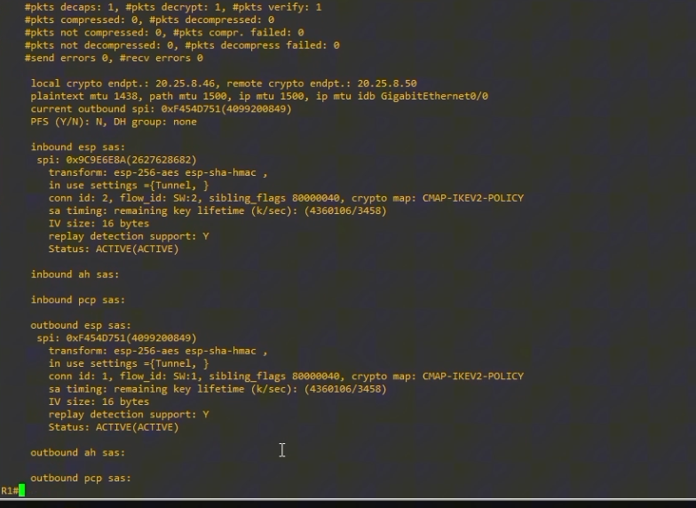
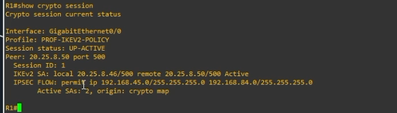
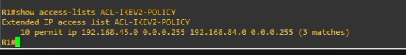
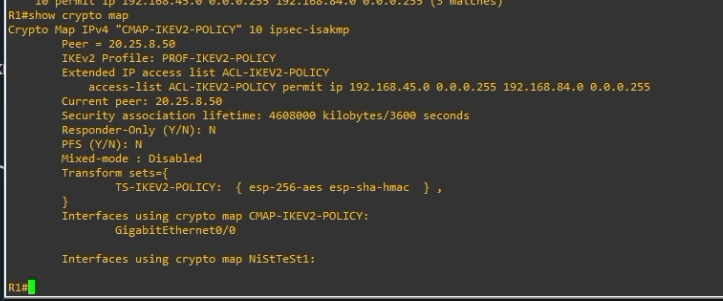
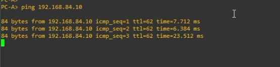

# VPN IPSec IKEv2 Policy-Based - Site-to-Site


**Estudiante:** Michael Robles  
**Matrícula:** 20250845  
**Tipo de VPN:** Site-to-Site punto a punto basada en políticas  
**Tecnología:** IPSec + IKEv2  
**Topología:** PC-A - SW1 - R1 - ISP - R2 - SW2 - PC-B


**Repositorio GitHub:** https://github.com/iClexi/VPN-IKEv2-Policy-Based/blob/main/README.md  
**Video demostrativo:** https://youtu.be/ueamM29DIdg  
**Documentación técnica profesional:** [docs/Documentacion Tecnica Profesional.pdf](docs/Documentacion%20Tecnica%20Profesional.pdf)

---

## 1. Objetivo del laboratorio

El objetivo de este laboratorio es configurar una **VPN site-to-site punto a punto basada en políticas usando IKEv2 e IPSec**. La VPN permite que la LAN A, ubicada detrás de R1, se comunique de forma segura con la LAN B, ubicada detrás de R2.

La comunicación entre ambas LAN pasa por el ISP, pero el tráfico privado no viaja en texto claro. Cuando PC-A se comunica con PC-B, R1 y R2 negocian IKEv2 y luego IPSec cifra los paquetes entre ambos routers.

---

## 2. Topología utilizada



La topología está compuesta por dos sitios:

| Sitio | Dispositivo | Red | IP principal |
|---|---|---:|---:|
| LAN A | PC-A | 192.168.45.0/24 | 192.168.45.10 |
| LAN A | R1 | Gateway LAN A | 192.168.45.1 |
| WAN | R1 | Enlace hacia ISP | 20.25.8.46/30 |
| WAN | ISP | Hacia R1 | 20.25.8.45/30 |
| WAN | ISP | Hacia R2 | 20.25.8.49/30 |
| WAN | R2 | Enlace hacia ISP | 20.25.8.50/30 |
| LAN B | R2 | Gateway LAN B | 192.168.84.1 |
| LAN B | PC-B | 192.168.84.0/24 | 192.168.84.10 |

---

## 3. Estructura del repositorio

```text
VPN-IKEv2-Policy-Based/
├── README.md
├── enlaces.txt
├── configs/
│   ├── R1.cfg
│   ├── R2.cfg
│   ├── ISP.cfg
│   ├── SW1.cfg
│   ├── SW2.cfg
│   ├── PC-A.vpcs
│   └── PC-B.vpcs
├── docs/
│   ├── Documentacion Tecnica Profesional.pdf
│   └── MichaelRobles_20250845_IKEv2_Policy_Based_Documentacion.docx
└── images/
    ├── 01_topologia.png
    ├── 02_r1_show_crypto_ikev2_sa.png
    ├── 03_r1_show_crypto_ipsec_sa_1.png
    ├── 04_r1_show_crypto_ipsec_sa_2.png
    ├── 05_r1_show_crypto_session.png
    ├── 06_r1_show_access_lists_acl_ikev2_policy.png
    ├── 07_r1_show_crypto_map.png
    └── 08_pc_a_ping_pc_b.png
```

Las configuraciones completas de cada equipo están dentro de la carpeta [`configs`](configs/). En este README se explican las partes principales, se muestran los comandos de verificación y se agregan las evidencias de funcionamiento.

La documentación técnica profesional está disponible en [`docs/Documentacion Tecnica Profesional.pdf`](docs/Documentacion%20Tecnica%20Profesional.pdf).

El archivo [`enlaces.txt`](enlaces.txt) contiene el enlace del repositorio en GitHub y el enlace del video demostrativo en YouTube.

---

## 4. ¿Qué es una VPN IKEv2 Policy-Based?

Una **VPN site-to-site** conecta dos redes completas. En este caso, conecta la LAN A `192.168.45.0/24` con la LAN B `192.168.84.0/24`.

Es **punto a punto** porque el túnel se forma directamente entre dos routers:

```text
R1 <====== VPN IPSec IKEv2 ======> R2
```

Es **policy-based** porque el router usa una política para decidir qué tráfico debe cifrarse. Esa política se define con una ACL llamada `ACL-IKEV2-POLICY`.

En R1, la ACL indica que se debe cifrar el tráfico desde la LAN A hacia la LAN B:

```cisco
permit ip 192.168.45.0 0.0.0.255 192.168.84.0 0.0.0.255
```

En R2, la ACL se configura al revés:

```cisco
permit ip 192.168.84.0 0.0.0.255 192.168.45.0 0.0.0.255
```

A ese tráfico se le llama **tráfico interesante**, porque es el tráfico que activa la VPN y que debe viajar protegido por IPSec.

---

## 5. Configuración base de los dispositivos

### PC-A

Para PC-A se configuró la IP `192.168.45.10/24` y como gateway se usó la IP LAN de R1:

```bash
ip 192.168.45.10/24 192.168.45.1
save
```

Configuración completa: [`configs/PC-A.vpcs`](configs/PC-A.vpcs)

### PC-B

Para PC-B se configuró la IP `192.168.84.10/24` y como gateway se usó la IP LAN de R2:

```bash
ip 192.168.84.10/24 192.168.84.1
save
```

Configuración completa: [`configs/PC-B.vpcs`](configs/PC-B.vpcs)

### SW1 y SW2

En SW1 se creó la VLAN 10 para la LAN A. En SW2 se creó la VLAN 20 para la LAN B. Los puertos conectados a los routers y a las PCs se configuraron como puertos de acceso.

Configuraciones completas:

- [`configs/SW1.cfg`](configs/SW1.cfg)
- [`configs/SW2.cfg`](configs/SW2.cfg)

### ISP

El ISP solamente conecta a R1 y R2 por la red WAN. No se le configuraron rutas hacia las LAN privadas, porque la idea del laboratorio es demostrar que el tráfico entre `192.168.45.0/24` y `192.168.84.0/24` depende de la VPN.

Configuración completa: [`configs/ISP.cfg`](configs/ISP.cfg)

---

## 6. Explicación del script de R1

La configuración completa de R1 está en [`configs/R1.cfg`](configs/R1.cfg).

### Interfaces y ruta por defecto

```cisco
interface GigabitEthernet0/0
 description WAN hacia ISP
 ip address 20.25.8.46 255.255.255.252
 no shutdown

interface GigabitEthernet0/1
 description LAN A hacia SW1
 ip address 192.168.45.1 255.255.255.0
 no shutdown

ip route 0.0.0.0 0.0.0.0 20.25.8.45
```

La interfaz `GigabitEthernet0/0` es la WAN de R1 hacia el ISP. Ahí se aplica el crypto map porque por esa interfaz sale el tráfico cifrado hacia R2.

La interfaz `GigabitEthernet0/1` es la LAN A y funciona como gateway de PC-A.

La ruta por defecto manda el tráfico desconocido hacia el ISP. Cuando ese tráfico coincide con la ACL de la VPN, el router lo cifra antes de enviarlo.

---

## 7. Explicación de la parte IKEv2

Esta es la parte más importante del laboratorio, porque IKEv2 se encarga de negociar la seguridad antes de que IPSec empiece a proteger el tráfico real.

### IKEv2 Proposal

```cisco
crypto ikev2 proposal PROP-IKEV2-POLICY
 encryption aes-cbc-256
 integrity sha256
 group 14
```

La **proposal** define los algoritmos que R1 propone usar durante la negociación IKEv2.

- `encryption aes-cbc-256`: usa AES de 256 bits para cifrado.
- `integrity sha256`: usa SHA-256 para validar integridad.
- `group 14`: usa Diffie-Hellman grupo 14 para generar claves de forma segura.

En palabras simples, este bloque define **qué nivel de seguridad se va a proponer para levantar la VPN**.

### IKEv2 Policy

```cisco
crypto ikev2 policy POL-IKEV2-POLICY
 proposal PROP-IKEV2-POLICY
```

La **policy** le dice al router que use la proposal anterior durante la negociación. La proposal define los algoritmos, y la policy la activa como opción válida para IKEv2.

### IKEv2 Keyring

```cisco
crypto ikev2 keyring KR-IKEV2-POLICY
 peer R2
  address 20.25.8.50
  pre-shared-key local ITLA20250845
  pre-shared-key remote ITLA20250845
```

El **keyring** guarda la información del peer VPN y la clave precompartida.

- `peer R2`: identifica al router remoto.
- `address 20.25.8.50`: indica que el peer remoto de R1 es la WAN de R2.
- `pre-shared-key`: define la clave compartida que ambos routers usarán para autenticarse.

Si la clave no coincide en R1 y R2, la VPN no levanta.

### IKEv2 Profile

```cisco
crypto ikev2 profile PROF-IKEV2-POLICY
 match identity remote address 20.25.8.50 255.255.255.255
 authentication remote pre-share
 authentication local pre-share
 keyring local KR-IKEV2-POLICY
```

El **profile** une la identidad del peer, el método de autenticación y el keyring.

- `match identity remote address`: indica contra qué peer se usará este perfil.
- `authentication remote pre-share`: el router remoto se autenticará con PSK.
- `authentication local pre-share`: el router local también se autenticará con PSK.
- `keyring local`: llama al keyring donde está guardada la clave.

En resumen, el perfil responde esta pregunta: **¿cómo reconozco y autentico al otro router?**

---

## 8. Explicación de IPSec, ACL y crypto map

### Transform-set IPSec

```cisco
crypto ipsec transform-set TS-IKEV2-POLICY esp-aes 256 esp-sha-hmac
 mode tunnel
```

El **transform-set** define cómo IPSec va a proteger el tráfico real entre PC-A y PC-B.

- `esp-aes 256`: cifra el tráfico con AES-256.
- `esp-sha-hmac`: valida integridad/autenticación de los paquetes IPSec.
- `mode tunnel`: encapsula el paquete original dentro de otro paquete IP. Este modo es el más común en VPN site-to-site.

### ACL de tráfico interesante

```cisco
ip access-list extended ACL-IKEV2-POLICY
 permit ip 192.168.45.0 0.0.0.255 192.168.84.0 0.0.0.255
```

Esta ACL no se usa para bloquear tráfico. Se usa para identificar qué tráfico debe ser cifrado. En R1, el tráfico interesante es el que va desde LAN A hacia LAN B.

### Crypto map

```cisco
crypto map CMAP-IKEV2-POLICY 10 ipsec-isakmp
 set peer 20.25.8.50
 set transform-set TS-IKEV2-POLICY
 set ikev2-profile PROF-IKEV2-POLICY
 match address ACL-IKEV2-POLICY
```

El **crypto map** une todas las piezas:

- `set peer`: indica el router remoto.
- `set transform-set`: indica cómo IPSec protegerá el tráfico.
- `set ikev2-profile`: indica qué perfil IKEv2 se usará para negociar.
- `match address`: indica qué ACL define el tráfico interesante.

Luego el crypto map se aplica en la interfaz WAN:

```cisco
interface GigabitEthernet0/0
 crypto map CMAP-IKEV2-POLICY
```

Esto permite que el router revise el tráfico que sale por la WAN y cifre el que coincida con la ACL.

---

## 9. Explicación del script de R2

La configuración completa de R2 está en [`configs/R2.cfg`](configs/R2.cfg).

R2 usa la misma lógica que R1, pero invertida. Su LAN local es `192.168.84.0/24` y la LAN remota es `192.168.45.0/24`.

Por eso, su ACL queda así:

```cisco
ip access-list extended ACL-IKEV2-POLICY
 permit ip 192.168.84.0 0.0.0.255 192.168.45.0 0.0.0.255
```

También cambia el peer remoto. Para R2, el peer es R1:

```cisco
set peer 20.25.8.46
```

Y en el perfil IKEv2 se reconoce la IP WAN de R1:

```cisco
match identity remote address 20.25.8.46 255.255.255.255
```

---

## 10. Diferencia entre IKEv1 e IKEv2

IKEv1 e IKEv2 sirven para negociar VPNs IPSec, pero IKEv2 es más moderno y más ordenado.

En IKEv1 normalmente se usan bloques como:

```cisco
crypto isakmp policy
crypto isakmp key
crypto ipsec transform-set
crypto map
```

En IKEv2 se separa mejor la configuración:

```cisco
crypto ikev2 proposal
crypto ikev2 policy
crypto ikev2 keyring
crypto ikev2 profile
crypto ipsec transform-set
crypto map
```

IKEv1 trabaja con el concepto tradicional de **Phase 1** y **Phase 2**. IKEv2 trabaja con **IKE SA** y **Child SA/IPSec SA**. En la práctica, IKEv2 es más limpio, más eficiente y más recomendado para configuraciones modernas.

---

## 11. Flujo de funcionamiento

Cuando PC-A hace ping hacia PC-B, ocurre lo siguiente:

1. PC-A envía tráfico hacia `192.168.84.10`.
2. El tráfico llega a R1.
3. R1 revisa la ACL `ACL-IKEV2-POLICY`.
4. Como el tráfico coincide con la ACL, se considera tráfico interesante.
5. R1 negocia IKEv2 con R2 usando la PSK `ITLA20250845`.
6. R1 y R2 acuerdan AES-256, SHA-256 y DH grupo 14.
7. Se crea la IKE SA.
8. Luego se crea la IPSec SA.
9. El tráfico real entre PC-A y PC-B viaja cifrado.
10. R2 recibe el tráfico, lo descifra y lo entrega a PC-B.

---

## 12. Verificación de funcionamiento

Para validar la VPN, primero se generó tráfico real desde PC-A hacia PC-B. Esto es importante porque una VPN policy-based normalmente levanta cuando detecta tráfico interesante que coincide con la ACL.

Primero se ejecutó este comando desde PC-A:

```bash
ping 192.168.84.10
```

Luego se verificó la negociación IKEv2, la sesión IPSec, los contadores de cifrado y los matches de la ACL.

### 12.1 Verificación de IKEv2 SA en R1



El comando `show crypto ikev2 sa` demuestra que la negociación IKEv2 fue exitosa. En la evidencia se observa el peer remoto `20.25.8.50` y el estado `READY`, lo cual confirma que R1 y R2 lograron crear la asociación de seguridad IKEv2.

### 12.2 Verificación de IPSec SA en R1



El comando `show crypto ipsec sa` demuestra que IPSec está protegiendo tráfico real. En la evidencia se observan paquetes `encaps`, `encrypt`, `decaps` y `decrypt`, lo cual indica que R1 está cifrando y descifrando tráfico correctamente.



En la continuación se observan las SAs inbound y outbound en estado `ACTIVE`. Esto confirma que existen asociaciones de seguridad para entrada y salida de tráfico IPSec.

### 12.3 Verificación de sesión VPN



El comando `show crypto session` muestra un resumen claro de la VPN. En la evidencia se observa `Session status: UP-ACTIVE`, el peer `20.25.8.50` y el flujo IPSec entre `192.168.45.0/24` y `192.168.84.0/24`.

### 12.4 Verificación de ACL de tráfico interesante



El comando `show access-lists ACL-IKEV2-POLICY` confirma que la ACL está haciendo match con el tráfico entre las dos LAN. En la evidencia se observan matches, lo que significa que el tráfico correcto está siendo seleccionado para la VPN.

### 12.5 Verificación del crypto map



El comando `show crypto map` confirma que el crypto map tiene configurado el peer correcto `20.25.8.50`, el transform-set `TS-IKEV2-POLICY`, el perfil `PROF-IKEV2-POLICY`, la ACL `ACL-IKEV2-POLICY` y que está aplicado en `GigabitEthernet0/0`.

### 12.6 Ping exitoso desde PC-A hacia PC-B



Finalmente, el ping desde PC-A hacia PC-B fue exitoso. Esto confirma que la comunicación extremo a extremo funciona y que el tráfico entre ambas LAN está pasando por la VPN IPSec IKEv2.

---

## 13. Comandos principales de verificación

En PC-A:

```bash
ping 192.168.84.10
```

En R1:

```cisco
show crypto ikev2 sa
show crypto ipsec sa
show crypto session
show access-lists ACL-IKEV2-POLICY
show crypto map
```

En R2:

```cisco
show crypto ikev2 sa
show crypto ipsec sa
show crypto session
show access-lists ACL-IKEV2-POLICY
show crypto map
```

---

## 14. Resultado final

La VPN IPSec IKEv2 Policy-Based quedó funcionando correctamente. Las evidencias muestran que:

- La IKE SA está en estado `READY`.
- La sesión VPN está `UP-ACTIVE`.
- La ACL tiene matches del tráfico interesante.
- El crypto map está aplicado en la interfaz WAN de R1.
- Los contadores IPSec muestran tráfico cifrado y descifrado.
- PC-A logra comunicarse con PC-B mediante ping.

Con esto se comprueba que la VPN site-to-site punto a punto basada en políticas está operando correctamente.
